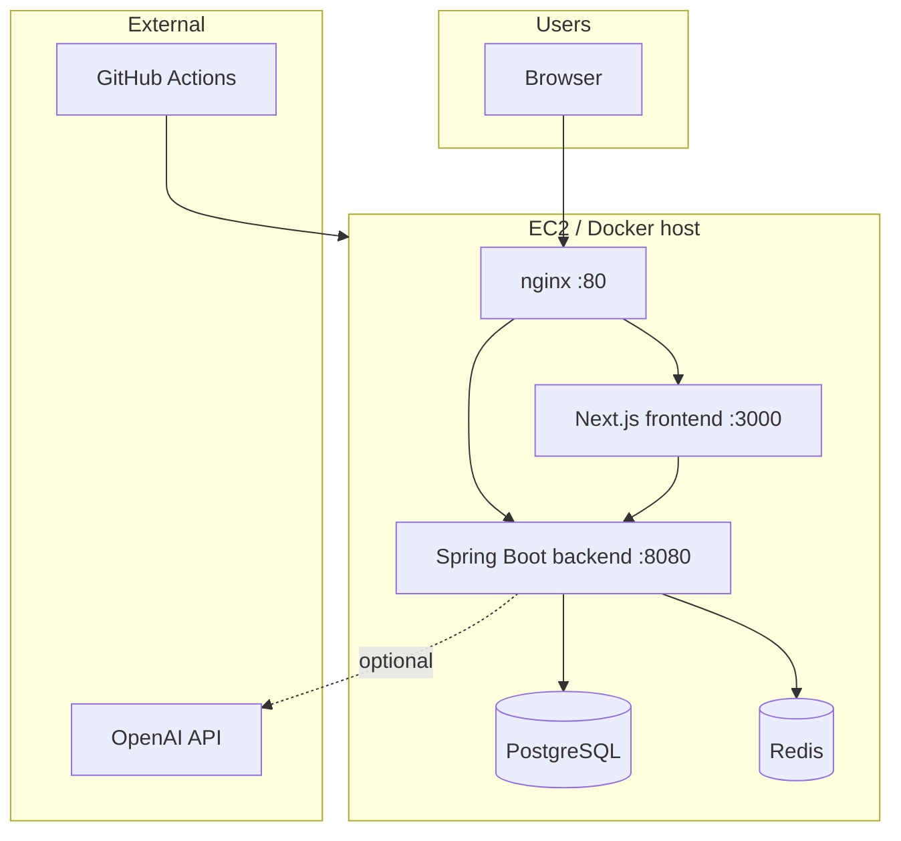
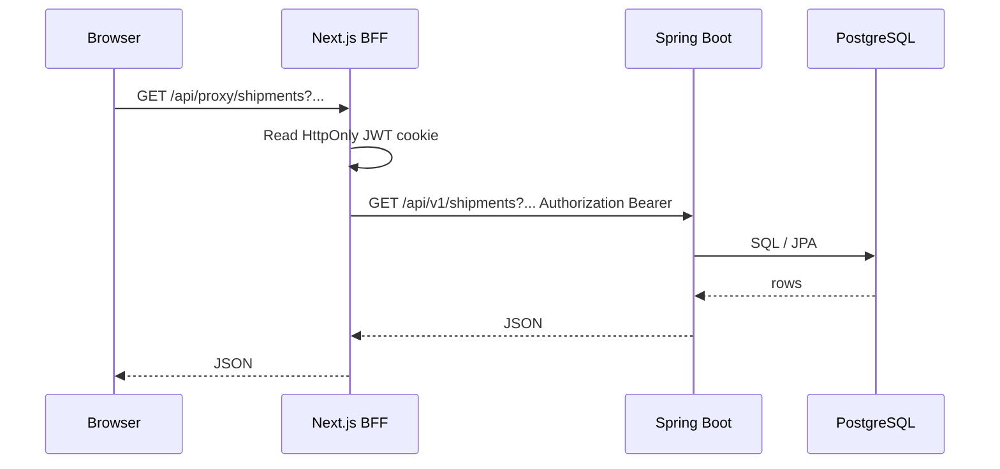

# NaqlaAI — System design & architecture

This document describes how the NaqlaAI logistics intelligence stack is structured: clients, edge routing, the Next.js application, the Spring Boot API, data stores, external AI, and how changes reach production.

---

## 1. System context (who talks to whom)

```
                         ┌─────────────────┐
                         │   OpenAI API    │
                         │  (LLM / tools)  │
                         └────────▲────────┘
                                  │ HTTPS
                                  │
┌──────────┐     HTTPS/WSS       ┌──────────────────────────────────────────┐
│ Browser  │ ──────────────────► │  EC2 (or local Docker Compose)           │
│ (user)   │                     │  ┌────────┐   ┌─────────┐   ┌────────┐  │
└──────────┘                     │  │ nginx  │──►│ Next.js │──►│ Spring │  │
                                 │  │  :80   │   │  :3000  │   │ :8080  │  │
                                 │  └───┬────┘   └────┬────┘   └───┬────┘  │
                                 │      │             │            │        │
                                 │      └─────────────┴────────────┘        │
                                 │                    │            │          │
                                 │              ┌─────▼───┐  ┌─────▼────┐     │
                                 │              │Postgres│  │  Redis   │     │
                                 │              │  :5432 │  │  :6379   │     │
                                 │              └────────┘  └──────────┘     │
                                 └──────────────────────────────────────────┘

         ┌────────────────┐
         │ GitHub Actions │  push main ──► tests + lint + build ──► SSH deploy
         └────────────────┘
```

**Roles**

- **Browser**: Renders the Next.js UI (App Router, locales `en` / `ar`), calls same-origin `/api/*` routes, and can open a WebSocket to the backend for live events (`/ws/events` on the API host).
- **nginx** (production EC2): Terminates HTTP on port 80; forwards `/api/v1/*`, `/actuator/*`, `/api-docs`, `/swagger-ui` to Spring Boot; forwards everything else (including the SPA) to Next.js.
- **Next.js**: Server-rendered pages, internationalization, and **BFF-style** routes (`/api/auth/login`, `/api/proxy/*`, `/api/ai/query`) that call the backend with the HttpOnly session cookie.
- **Spring Boot**: REST API under `/api/v1`, JWT security, JPA/Flyway against PostgreSQL, Redis for AI cache/memory and supporting features, optional OpenAI integration for query/action agents.
- **PostgreSQL**: Primary transactional and read-model data for logistics entities and users.
- **Redis**: Caching and AI-related TTL structures (see `application.yml` `app.ai.*`).
- **GitHub Actions**: Quality gates (Maven tests, npm lint/build) then deploy to EC2 via `git pull` and `deploy/ec2/deploy.sh`.

---

## 2. Logical architecture (layers)

```
┌─────────────────────────────────────────────────────────────────────────────┐
│ Presentation (Next.js  —  `frontend/`)                                     │
│  • App Router, `[locale]` routes, protected dashboard shell                  │
│  • React Query (`use-dashboard-data`, etc.)                                  │
│  • UI: KPIs, shipments, drivers, routes, map, alerts, events, AI command bar │
└───────────────────────────────────┬─────────────────────────────────────────┘
                                    │ fetch same-origin
                                    ▼
┌─────────────────────────────────────────────────────────────────────────────┐
│ Edge / BFF (Next.js Route Handlers —  `frontend/app/api/`)                  │
│  • POST `/api/auth/login`     → backend `/api/v1/auth/login`, sets cookie  │
│  • POST `/api/auth/logout`   → clears session                               │
│  • GET  `/api/proxy/[...path]` → backend `/api/v1/{path}` + Bearer from JWT │
│  • POST `/api/ai/query`      → backend `/api/v1/ai/query`                   │
└───────────────────────────────────┬─────────────────────────────────────────┘
                                    │ server-side HTTP (Docker network / env)
                                    ▼
┌─────────────────────────────────────────────────────────────────────────────┐
│ Application API (Spring Boot  —  `backend/`)                                │
│  • Controllers: Auth, Shipments, AI, health, secured resources               │
│  • Domain services: e.g. `ShipmentService` + filters + access scope         │
│  • AI: `QueryAgentService`, `ActionAgentService`, tools, memory, monitor     │
│  • Realtime: `LiveEventsWebSocketHandler` @ `/ws/events`                     │
│  • Security: JWT filter, method security (`ADMIN`, `MANAGER`, `VIEWER`)      │
└───────────────┬─────────────────────────────┬───────────────────────────────┘
                │ JDBC                         │ Redis protocol
                ▼                              ▼
        ┌───────────────┐              ┌───────────────┐
        │  PostgreSQL   │              │     Redis     │
        └───────────────┘              └───────────────┘
                │
                │ Flyway migrations (`classpath:db/migration`)
                ▼
        (schema validated at startup; `ddl-auto: validate`)
```

---

## 3. Request flows

### 3.1 Login (credential → HttpOnly cookie)

```
Browser                Next.js                    Spring Boot
   │    POST /api/auth/login        POST /api/v1/auth/login
   │ ─────────────────────────► ─────────────────────────────►
   │                               ◄── JSON { token, userId, ... }
   │    ◄── Set-Cookie: naqlaai_token (httpOnly)
   │        + user profile JSON (no raw JWT to JS)
```

### 3.2 Authenticated API read (dashboard, lists, map)

```
Browser                Next.js proxy              Spring Boot + DB
   │   GET /api/proxy/dashboard/kpis
   │ ─────────────────────────►  reads cookie → Bearer token
   │                              GET /api/v1/dashboard/kpis
   │                              ─────────────────────────────►
   │                              ◄─────────────────────────────
   │   ◄── JSON body
```

### 3.3 AI natural-language query

```
Browser    POST /api/ai/query    Next.js    POST /api/v1/ai/query    Spring Boot
                                              │
                                              ├──► Redis (cache / memory TTLs)
                                              ├──► PostgreSQL (via tool / read repos)
                                              └──► OpenAI (when enabled + API key)
```

---

## 4. Backend module map (conceptual)

```
com.naqlaai.backend
├── api/              REST controllers + DTOs  (/api/v1/...)
├── core/             Shipment domain services, access scope, filters
├── data/             JPA entities, repositories (shipments, logistics read, users)
├── security/         JWT, users, optional AWS Secrets Manager hook
├── ai/               LLM config, query/action agents, tools, prompts, monitor
└── realtime/         WebSocket registration + live event broadcasting
```

---

## 5. Deployment topology (EC2)

Production compose (`deploy/ec2/docker-compose.ec2.yml`) runs four containers plus volumes:

```
                    Internet
                        │
                        ▼
                 ┌─────────────┐
                 │   nginx     │  :80  (TLS often added at CDN or host level)
                 └──────┬──────┘
        ┌───────────────┼───────────────┐
        │               │               │
        ▼               ▼               ▼
   frontend:3000   backend:8080    (static/API paths
   Next.js          Spring Boot     routed by location)
        │               │
        │               ├── postgres:5432
        │               └── redis:6379
        │
   env: API_BASE_URL → http://backend:8080
```

CI/CD (`.github/workflows/deploy-ec2.yml`): on `main`, run backend tests and frontend lint/build, then SSH to the server, `git pull`, and `./deploy/ec2/deploy.sh`.

Local dev (`docker-compose.yml` at repo root): same four logical tiers; frontend exposes `3000`, backend `8080`, Postgres and Redis with healthchecks.

**WebSocket note:** The backend exposes `/ws/events`. The bundled EC2 nginx config routes `/api/v1/*` (and docs) to Spring Boot and sends `location /` to Next.js. If the browser must use live WebSockets through the same host and port as the SPA, add an nginx `location` that upgrades and proxies `/ws/` to `http://backend:8080` (otherwise point the client WebSocket URL at wherever the API is reachable).

---

## 6. Mermaid diagrams (for GitHub, docs sites, or Mermaid-enabled pages)

### 6.1 Container diagram (C4-style)



### 6.2 Sequence: protected REST via BFF



---

## 7. Security notes (high level)

- **Sessions**: JWT stored in **HttpOnly** cookie (`naqlaai_token`); browser JavaScript does not hold the token for API calls—Next.js route handlers attach it when proxying.
- **Backend**: Stateless JWT validation on each request; role-based access on AI and admin paths.
- **Secrets**: Production expects env vars (`JWT_SECRET_BASE64`, DB/Redis passwords, `OPENAI_API_KEY`); optional AWS Secrets Manager toggle exists in config.

---

## 8. Operational endpoints

| Surface | Path | Purpose |
|--------|------|--------|
| API | `/api/v1/**` | Versioned REST API |
| Docs | `/swagger-ui`, `/api-docs` | OpenAPI / Swagger UI |
| Health | `/actuator/health` | Liveness / orchestration |
| Realtime | `/ws/events` | Live logistics events (WebSocket on backend) |

---

## 9. How to use this file on a deployed page

- **Paste sections** into any Markdown-capable CMS or static page.
- **Mermaid**: If your site does not render Mermaid by default, embed a [Mermaid Live](https://mermaid.live) export as SVG/PNG, or add a client-side Mermaid script for the diagrams in §6.
- **ASCII diagrams** (§1–§5) render anywhere monospace text is shown.

---

*Generated from the repository layout (`frontend`, `backend`, `deploy/ec2`, `docker-compose.yml`, GitHub workflows). Update this document when you add new services, queues, or edge components.*
